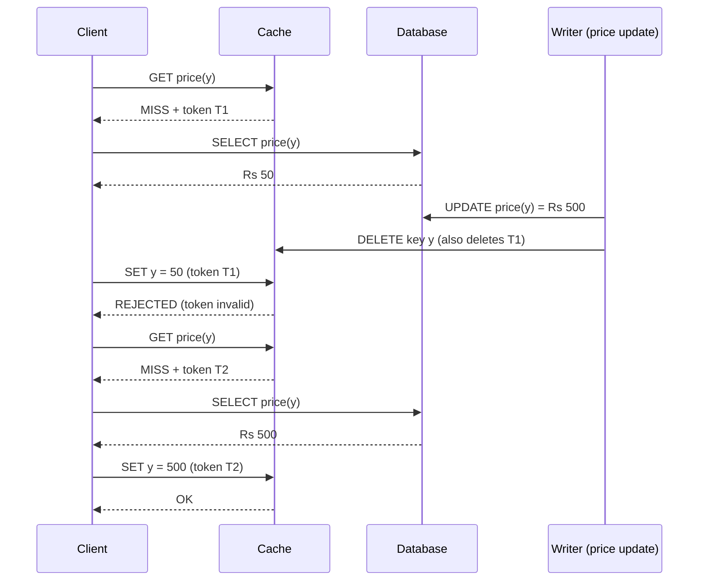

# Cache Design: Preventing Stale Writes with Invalidation Tokens

## 1. Overview

Read requests hit the cache first for speed. On a cache miss, the DB is queried and the result is written back to the cache. Cache entries also expire via a TTL (for example, 5 minutes) so they get refreshed from the DB periodically.

This design describes a race condition between a cache-fill and a DB update, and a token-based solution that prevents stale data from being written into the cache.

## 2. Basic Read Flow

1. Client sends a request (e.g. price of product `y`).
2. The cache is checked first.
3. **Cache hit:** return the cached value.
4. **Cache miss:** query the DB, return the value, and populate the cache.
5. TTL (say 5 minutes) expires entries so they are refreshed from the DB.

## 3. The Problem: Stale Write Race Condition

Scenario: a customer requests the price of product `y`, and it is not in the cache.

| Step | Event |
|------|-------|
| 1 | Cache miss for product `y`. |
| 2 | DB is queried. Price at this moment is **Rs 50**. |
| 3 | The value (Rs 50) is on its way to be written into the cache. |
| 4 | Meanwhile, the price is updated in the DB to **Rs 500**, and the cache entry is invalidated/deleted. |
| 5 | The delayed write of Rs 50 arrives at the cache and gets stored. |

**Result:** the cache now holds Rs 50 (stale) while the DB holds Rs 500. The stale value stays until the TTL expires, so customers see the wrong price.

The root cause is that the in-flight data was already expired (outdated) by the time it reached the cache, but the cache had no way to know.

## 4. Solution: Token (Lease) Based Cache Fill

When a cache miss occurs, the cache issues a **token** to the requester. The requester must present this token when writing the fetched value back. If the token is no longer valid, the write is rejected.

### 4.1 Rules

1. On a cache miss, the cache generates a unique token tied to that key and returns it with the miss response.
2. The requester reads from the DB and sends `(key, value, token)` to the cache.
3. The cache accepts the write **only if the token is still valid** for that key.
4. When the key is invalidated (DB update, delete, or TTL expiry), the cache deletes the key **and all tokens associated with it**.
5. A write that arrives with a deleted or expired token is rejected, so the stale value is never stored.

### 4.2 Corrected Flow (same scenario)

| Step | Event |
|------|-------|
| 1 | Cache miss for product `y`; the cache issues **token T1**. |
| 2 | DB is queried; price is Rs 50. |
| 3 | Rs 50 + T1 is on its way to the cache. |
| 4 | Price is updated to Rs 500 in the DB; the delete/invalidate removes the key **and token T1**. |
| 5 | Rs 50 + T1 reaches the cache; T1 is invalid, so the **write is rejected**. |
| 6 | The next request misses again, gets a new token T2, reads Rs 500 from the DB, and the write with T2 succeeds. |

**Result:** the cache never holds the stale Rs 50, and eventually holds the correct Rs 500.

## 5. Sequence Diagram

## 6. Design Notes

- **Token scope:** tokens are per key. Invalidating a key invalidates all its outstanding tokens.
- **Token expiry:** tokens should also have a short lifetime so abandoned fills do not linger.
- **TTL interaction:** TTL expiry also deletes the key and its tokens, so a fill that straddles a TTL expiry is safely rejected.
- **Thundering herd (optional):** the cache can issue only one token at a time per key. Other requesters wait briefly or retry, which reduces duplicate DB reads.
- **Failure behavior:** a rejected write is not an error for the client. The client already has a value to return, and the cache is simply refilled on a later miss.
- **Trade-off:** a few extra cache misses after invalidations, in exchange for strong protection against stale entries.

## 7. Summary

Without tokens, a slow cache-fill can overwrite a newer invalidation with old data. With tokens, every fill must prove that no invalidation happened since the miss. Invalidation removes the token, so stale in-flight data is discarded and the cache stays consistent with the DB.
