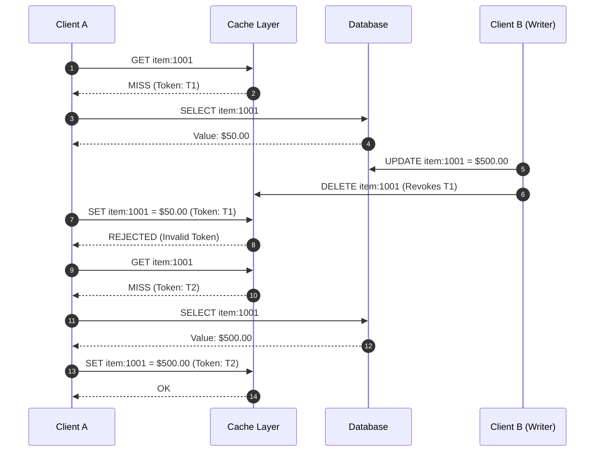

# Invalidation Tokens for Stale Write Prevention in Cache-Aside Systems

## Abstract

In a cache-aside architecture, asynchronous backfills following a cache miss are susceptible to concurrency race conditions. A delayed write-back can overwrite an explicit cache invalidation triggered by a concurrent database write, leaving stale data in the cache until TTL expiration. 

This document specifies an invalidation token (lease) protocol that guarantees cache consistency by rejecting stale write-backs.

---

## 1. Problem Statement

### 1.1 Standard Cache-Aside Read Flow

1. **Client Request**: The client requests a resource key (e.g., `item:1001`).
2. **Cache Lookup**: On a cache hit, the cached value is returned directly.
3. **Database Fallback**: On a cache miss, the client reads the source of truth from the primary database, returns the value, and writes the fetched value back to the cache with a predefined Time-To-Live (TTL).

### 1.2 Stale Write Race Condition

When a database update coincides with an in-flight cache backfill, a race condition can occur:

| Timeline | Component Action | State |
| :--- | :--- | :--- |
| `t0` | Client A reads key `item:1001` | Cache Miss |
| `t1` | Client A queries Database | Database returns `$50.00` |
| `t2` | Client B updates `item:1001` in Database to `$500.00` | Database updated to `$500.00` |
| `t3` | Client B invalidates `item:1001` in Cache | Cache key deleted |
| `t4` | Client A completes delayed backfill (`SET item:1001 = $50.00`) | Stale value cached |

**Failure Impact**: The cache stores `$50.00` while the database holds `$500.00`. The inconsistent state persists until the entry's TTL expires, exposing downstream clients to stale data.

---

## 2. Solution: Lease-Based Invalidation Tokens

To prevent stale writes, the cache issues a unique, short-lived **invalidation token** (lease) whenever a cache miss occurs. Clients must supply this token when performing a write-back.

### 2.1 Protocol Rules

1. **Token Generation**: On a cache miss, the cache generates a unique token $T$ associated with the requested key and returns $(MISS, T)$ to the client.
2. **Conditional Write**: The client queries the database and sends `SET key value token` to the cache.
3. **Validation**: The cache accepts and commits the write only if token $T$ is still valid for that key.
4. **Token Revocation**: Any write, delete, or invalidation operation on a key immediately revokes all outstanding tokens associated with that key.
5. **Rejection**: Writes bearing revoked or expired tokens are rejected, preventing stale in-flight data from populating the cache.

### 2.2 Corrected Execution Flow

| Timeline | Component Action | Result |
| :--- | :--- | :--- |
| `t0` | Client A requests `item:1001` | Cache Miss, Token `T1` issued |
| `t1` | Client A queries Database | Database returns `$50.00` |
| `t2` | Client B updates Database (`item:1001` = `$500.00`) | Database updated |
| `t3` | Client B invalidates `item:1001` in Cache | Key deleted, Token `T1` revoked |
| `t4` | Client A attempts write (`SET item:1001 = $50.00`, Token `T1`) | **Rejected** (Token `T1` invalid) |
| `t5` | Subsequent read request for `item:1001` | Cache Miss, Token `T2` issued |
| `t6` | Subsequent backfill completes with `T2` | **Accepted** (`$500.00` cached) |

---

## 3. Sequence Diagram

---

## 4. Technical Considerations

### 4.1 Token Lifetime & Scope
- **Key-Scoped Isolation**: Tokens are strictly scoped to individual keys. Invalidating key $K$ revokes only the active tokens bound to $K$.
- **Lease Expiration**: Tokens carry an explicit TTL independent of key TTL to ensure abandoned backfills are purged automatically.

### 4.2 Handling TTL Expiration
- Key expiration triggered by standard TTL sweeps or evictions automatically revokes active tokens associated with that key. A backfill that spans a TTL boundary is safely rejected.

### 4.3 Thundering Herd Mitigation
- The token mechanism can be extended to issue at most one active lease per key. Concurrent requests during a cache miss can either await the initial backfill or retry, reducing database load spikes.

### 4.4 Failure Semantics
- A rejected cache write does not constitute an application error. The client returns the fresh database value directly, and subsequent read requests naturally retry the backfill with a new token.

---

## 5. Summary

Invalidation tokens eliminate stale write race conditions by ensuring that every write-back proves no cache invalidation occurred while the database query was in flight. By invalidating tokens alongside keys, stale data is deterministically discarded, maintaining strong cache-to-database consistency.
